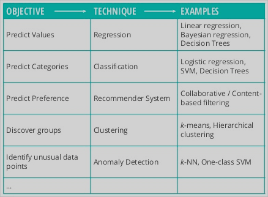

    

# Business

## Business Understanding

Business understanding is the part where you ask the question to the customer to understand the requirements

    What does the client want to achieve?

### Determine

What is the primary objective of the client? 

* Reduce attrition
* Customized targeting
* Plan future media spend
* Prevent fraud
* Recommend products

### Understand

* Understanding success criteria

    * Specific, measurable, time-bound

* List assumptions, constraints, and important factors

* Study exisitng solutions (if any)

### Map

    Business Objectibe ->  Technical Objective

* State the **project objective(s) in technical terms**

* Describe how the data science project will **help solve the business problem**

* Explore **Successful scenarios**

    

---

## Data Preparation

### Identify

* **Data Sources, formats**

    * Database, Streaming APIs, Logs, Excel files, Websites, etc.

* **Entity Relationship Diagram** (ERD)

* Identify **additional data sources.**

    * Demographics data appends,

    * Geographical data,

    * Census data, etc.

* Identify **relevant data.**

* Record **unavailable data.**

* How long a history is available and one should use?

### Collect

* Access or acquire all relevant data to **a central location**

* **Quality control checks and tests**

    * File formats, delimiters

    * Number of records, columns

    * Primary keys

### Assess

* **Get familiar** with the data

* Study **seasonality**

    * Monthly / weekly / daily patterns

    * Unexplained gaps and spikes

* Detect **mistakes**

    * Extreme or outlier values

    * Unusual values

    * Special missing values

* Check **assumptions**

* Review **distributions.**

# Statistics

## Data Munging

    Give me six hours to chop down a tree and I will spend the first four sharpening the axe. - Anonymous

* **Descriptive statistics**

    * Review with the client

* **Correlation analysis**

    * Review with the client

    * Watch out for data leakage

* **Impute missing values**

* **Trim extreme values**

* **Process categorical attributes**

* **Transformations** (square, log, etc.)

    * Binning / variable smoothing

* **Multicollinearity**

    * Reduce redundancy

* **Create additional feature**

* **Interactions**

* **Normalization** (scaling)

### Feature Reduction

The process of **selecting a subset of features** for use in model construction.

* Userful for both supervised and unsupervised learning problems

---

## Model Training

* Try **more than one machine learning techniques**

* Fine-tune **parameters**

* Assess **model performance**

* Avoid **Over-fitting**

---

## Model Evaluation

### Model Selection

* **Law of Parismony** (Occam's Razor)

* **Model execution time**

* **Deployment complexity**

    Build the simplest solution that can adequately answer the question.

### Assessment

* Validate atleast 20% of the dataset using either Temporal data or any random data

### Presentation

    Interpret results as they relate to the business application.

# Computer Science

## Model Deployment

* **Model production cycle**

* **Scoring code, or publish model as a web service**

    * Hand-off

* **Model Documentation** (Technical Specifications)

    * Data preparation, transformations, imputations, parameter settings, etc.

* **Reproducibility**

    * Docker containers

---

## Model Tracking

### Monitor

* **Model decay tracking (monitoring) plan**

    * Model performance over time

    * Predictor distribution

### Maintain

* **Model maintenance plan**

* **Adding new data sources**

* **Version control**

### Test

* **Campaign Set-up and Execution**

    * Experimental Design (A/B test, Fractional Factorial)
